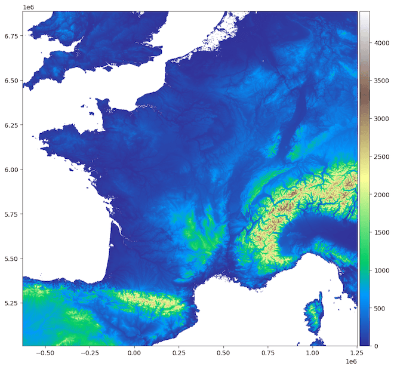

👨‍💻 Usage examples
=====================

Getting Started: Installing Elevatr
------------------------------------

First things first: install the latest version of :kbd:`elevatr` using the command below.

.. code-block:: bash

    pip install elevatr

----

1. Downloading Raster Elevation Data ⬇️
----------------------------------------

Let’s dive into a simple example of how to download raster elevation data with :kbd:`elevatr`. Here’s how it works:

.. code-block:: python

    import elevatr as elv

    # Define the bounding box of the area of interest (min_lon, min_lat, max_lon, max_lat)
    bbx = (-5.14, 41.33, 9.56, 51.09)

    # Set the level of precision (between 0 and 14)
    zoom = 6

    # Access the elevation data
    raster = elv.get_elev_raster(locations=bbx, zoom=zoom)

Advanced Options

Need to manage cache efficiently? Use these handy parameters:

* :guilabel:`cache_folder` : Specify where to store cache files.

* :guilabel:`use_cache` : Decide if existing cache should be reused.

* :guilabel:`delete_cache` : Clean up cache after use.

For more details, check out the `full documentation <documentation.html>`_.

-----

2. Use the Raster 🗺️
---------------------

The :guilabel:`Raster` class in elevatr makes working with raster data intuitive and enjoyable. Here’s what you can do:

Visualizing the Raster Data
~~~~~~~~~~~~~~~~~~~~~~~~~~~

Want to see your elevation data? No problem!

.. code-block:: python

    raster.show(cmap='terrain', clip_zero=True)

And here’s an example of what you might see:

Converting the Raster to a NumPy Array
~~~~~~~~~~~~~~~~~~~~~~~~~~~~~~~~~~~~~~

Need the data in array format for further processing? It’s just as easy:

.. code-block:: python

    raster_array = raster.to_numpy()

Sample output:

.. code-block:: python

    array([[  -75,   -76,   -77, ...,    56,    57,    57],
        [  -77,   -78,   -78, ...,    56,    56,    56],
        [  -78,   -79,   -79, ...,    56,    55,    55],
        ...,
        [  853,   861,   863, ..., -1513, -1601, -1648],
        [  839,   847,   857, ..., -1568, -1646, -1677],
        [  819,   823,   830, ..., -1631, -1722, -1773]], dtype=int16)

Saving the Raster as a GeoTIFF File
~~~~~~~~~~~~~~~~~~~~~~~~~~~~~~~~~~~~

Want to keep your elevation data for later? Save it as a GeoTIFF file:

.. code-block:: python

    raster.to_tif('elevation.tif')

----

That’s it! You’re ready to start exploring elevation data with elevatr. Whether you’re visualizing, analyzing, or saving, this library has got you covered. Happy mapping! 🌍⭐
